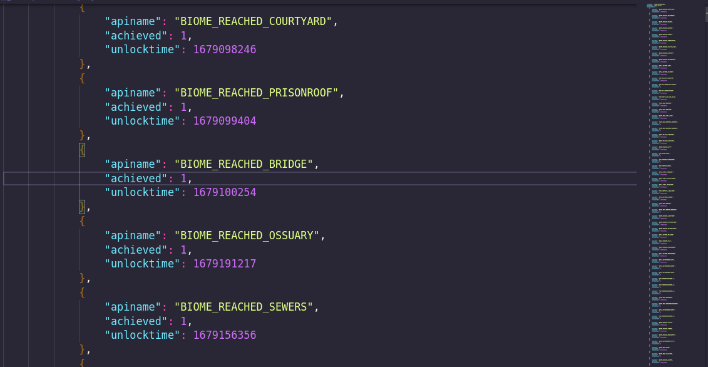

# steam-wrapper-api 


## What is it?

this is an unofficial library wrapper for the steam API

**steam-wrapper-api** simplifies the use of the API, making it easier to use

# dependencies

```shell
pip install -r requirements.txt
```

# Installing

you can install using pip

```pip install steam-wrapper-api```

# Using

here are some usage examples

## making a file to auth with api_key

a json file will be generated with your api_key named API_steam.json

```python
import steam_api

steam_api.create_auth_json('YOUR_API_KEY')
```

## loading the api_key with auth file

``` python
import steam_api

api_key = steam_api.load_auth_json() 
```

## getting steam user profile data

``` python
import steam_api

steam = steam_api.Steam('YOUR_API_KEY')
profile_data = steam.get_player_summaries('steam_id')
```

## setting xml as response default

you can change the default format of response of the API to **xml**

the default is **json**
``` python
import steam_api

steam = steam_api.Steam('YOUR_API_KEY', 'xml')
```

## writing formatted data

```python
from steam_api import Steam

steam = Steam('YOUR_API_KEY')
player_achievements = steam.get_player_achievements(steam_id='xxxxxxxxxxx', app_id=000000)
steam.write_content(content=player_achievements, file_path='./player_achievements.json')

```

```output```



# docs

the documentation of api can be found in: ***https://developer.valvesoftware.com/wiki/Steam_Web_API#GetNewsForApp_.28v0001.29***

# contributing

all contributions are welcome, the repository in github is: ***https://github.com/gabriel-batistuta/steam-wrapper-api***